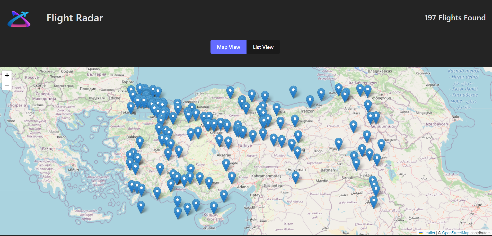
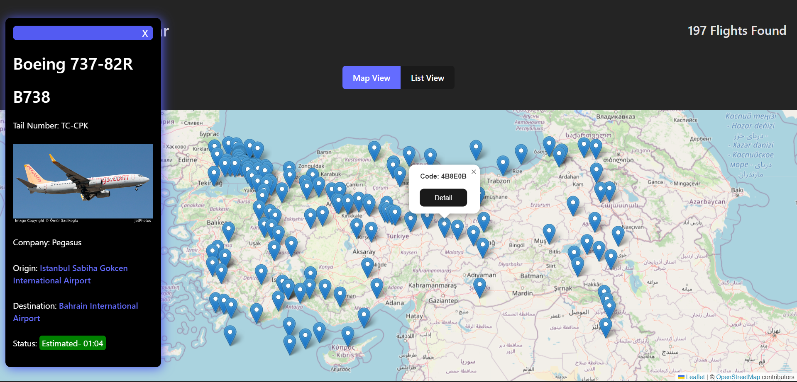
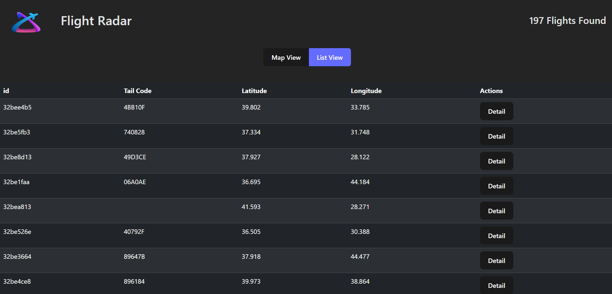

# Kütüphaneler

-leaflet
-react-leaflet
-react-redux
-@reduxjs/toolkit
-axios
-react-paginate
-thunk(toolkit içerisinde)

# Kaynaklar

- API: https://rapidapi.com/apidojo/api/flight-radar1

- Liste görünümü "ListView.jsx" bileşeni oluştur
- Harita görünümü "MapView.jsx" bileşeni oluştur
- App.js içerisinde bu iki görünüm arasında geçiş sağla

"MapView.jsx" de harita(react leaflet) kurulumunu yap.

-Toolkit ile beraber redux kurulumunu yap.

#Screenshoots

